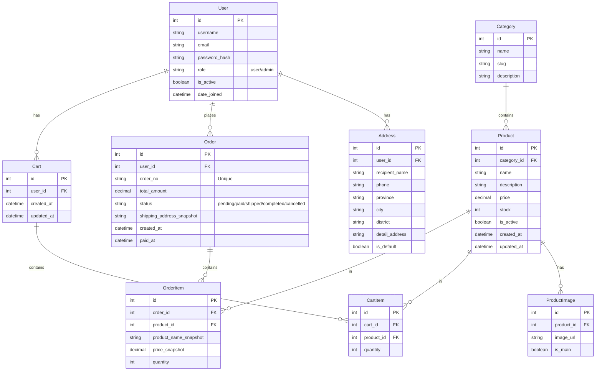

# 数据库设计文档 (Database Design)

## 1. 数据库概览
- **数据库类型**：PostgreSQL
- **字符集**：UTF-8
- **时区**：UTC (应用层处理时区转换)

## 2. 实体关系图 (ER Diagram)

## 3. 数据表详细定义

### 3.1 用户表 (User)
继承自 Django AbstractUser，扩展角色字段。
| 字段名 | 类型 | 约束 | 说明 |
| :--- | :--- | :--- | :--- |
| id | Integer | PK, Auto | 用户ID |
| username | Varchar(150) | Unique, Not Null | 用户名 |
| email | Varchar(254) | Unique, Not Null | 邮箱 |
| password | Varchar(128) | Not Null | 加密后的密码 |
| role | Varchar(10) | Default='user' | 角色：`user`, `admin` |
| avatar | ImageField | Nullable | 用户头像 |
| is_active | Boolean | Default=True | 是否激活 (用于封号) |
| date_joined | DateTime | AutoNowAdd | 注册时间 |

### 3.2 收货地址表 (Address)
| 字段名 | 类型 | 约束 | 说明 |
| :--- | :--- | :--- | :--- |
| id | Integer | PK, Auto | 地址ID |
| user | ForeignKey | User, OnDelete=Cascade | 所属用户 |
| recipient_name | Varchar(50) | Not Null | 收货人姓名 |
| phone | Varchar(20) | Not Null | 联系电话 |
| province | Varchar(50) | Not Null | 省份 |
| city | Varchar(50) | Not Null | 城市 |
| district | Varchar(50) | Not Null | 区/县 |
| address | Varchar(200) | Not Null | 详细地址 |
| is_default | Boolean | Default=False | 是否默认地址 |

### 3.3 商品分类表 (Category)
| 字段名 | 类型 | 约束 | 说明 |
| :--- | :--- | :--- | :--- |
| id | Integer | PK, Auto | 分类ID |
| name | Varchar(50) | Not Null | 分类名称 |
| slug | Varchar(50) | Unique | URL友好的标识符 |
| icon | ImageField | Nullable | 分类图标 |

### 3.4 商品表 (Product)
| 字段名 | 类型 | 约束 | 说明 |
| :--- | :--- | :--- | :--- |
| id | Integer | PK, Auto | 商品ID |
| category | ForeignKey | Category, OnDelete=Protect | 所属分类 |
| name | Varchar(100) | Not Null | 商品名称 |
| description | Text | Nullable | 商品详情描述 |
| price | Decimal(10, 2) | Not Null | 销售价格 |
| stock | Integer | Default=0 | 库存数量 |
| is_active | Boolean | Default=True | 是否上架 |
| created_at | DateTime | AutoNowAdd | 创建时间 |
| updated_at | DateTime | AutoNow | 更新时间 |

### 3.5 商品图片表 (ProductImage)
| 字段名 | 类型 | 约束 | 说明 |
| :--- | :--- | :--- | :--- |
| id | Integer | PK, Auto | 图片ID |
| product | ForeignKey | Product, OnDelete=Cascade | 所属商品 |
| image | ImageField | Not Null | 图片文件路径 |
| is_main | Boolean | Default=False | 是否为主图 (封面) |

### 3.6 购物车表 (Cart)
通常与用户一对一，也可以设计为 Session 关联。这里设计为用户关联。
| 字段名 | 类型 | 约束 | 说明 |
| :--- | :--- | :--- | :--- |
| id | Integer | PK, Auto | 购物车ID |
| user | ForeignKey | User, OnDelete=Cascade | 所属用户 |
| created_at | DateTime | AutoNowAdd | 创建时间 |

### 3.7 购物车条目表 (CartItem)
| 字段名 | 类型 | 约束 | 说明 |
| :--- | :--- | :--- | :--- |
| id | Integer | PK, Auto | 条目ID |
| cart | ForeignKey | Cart, OnDelete=Cascade | 所属购物车 |
| product | ForeignKey | Product, OnDelete=Cascade | 商品 |
| quantity | Integer | Default=1 | 数量 |

### 3.8 订单表 (Order)
| 字段名 | 类型 | 约束 | 说明 |
| :--- | :--- | :--- | :--- |
| id | Integer | PK, Auto | 订单ID |
| user | ForeignKey | User, OnDelete=Protect | 下单用户 |
| order_no | Varchar(32) | Unique | 订单编号 (如: 202311250001) |
| total_amount | Decimal(10, 2) | Not Null | 订单总金额 |
| status | Varchar(20) | Default='pending' | 状态: pending, paid, shipped, completed, cancelled |
| shipping_name | Varchar(50) | Not Null | 收货人快照 |
| shipping_phone | Varchar(20) | Not Null | 电话快照 |
| shipping_address | Varchar(255) | Not Null | 地址快照 |
| created_at | DateTime | AutoNowAdd | 下单时间 |
| paid_at | DateTime | Nullable | 支付时间 |

### 3.9 订单条目表 (OrderItem)
| 字段名 | 类型 | 约束 | 说明 |
| :--- | :--- | :--- | :--- |
| id | Integer | PK, Auto | 条目ID |
| order | ForeignKey | Order, OnDelete=Cascade | 所属订单 |
| product | ForeignKey | Product, OnDelete=SetNull | 商品 (若商品删除，保留记录) |
| product_name | Varchar(100) | Not Null | 商品名称快照 |
| price | Decimal(10, 2) | Not Null | 购买时单价快照 |
| quantity | Integer | Not Null | 购买数量 |

---

## 4. 关键业务逻辑说明

### 4.1 库存扣减
- **方案**：下单时预占库存 (Lock) 或 支付成功后扣减。
- **本项目推荐**：下单时检查库存并扣减 (Atomic Transaction)。若超时未支付 (如30分钟)，通过定时任务 (Celery/Cron) 恢复库存并取消订单。

### 4.2 订单状态流转
1. **Pending (待支付)**: 用户提交订单，库存 -N。
2. **Paid (已支付)**: 用户完成支付，记录 `paid_at`。
3. **Shipped (已发货)**: 管理员填写物流信息，确认发货。
4. **Completed (已完成)**: 用户确认收货，或发货后N天自动确认。
5. **Cancelled (已取消)**: 用户手动取消或超时未支付。库存 +N。

### 4.3 数据快照
订单生成时，必须将收货地址、商品名称、商品价格等信息**复制**到 `Order` 和 `OrderItem` 表中。防止后续用户修改地址或管理员修改商品价格影响历史订单数据的准确性。
