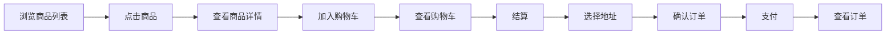
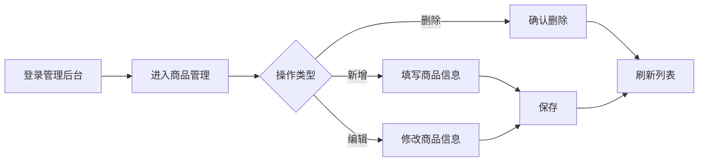

# 前端界面设计文档 (Frontend UI Design)

## 1. 页面总览

本系统包含以下主要页面：

### 1.1 用户端页面
| 页面名称 | 路由路径 | 功能说明 |
| :--- | :--- | :--- |
| 商品列表页（首页） | `/` | 展示所有商品，支持分类筛选和搜索 |
| 商品详情页 | `/product/:id` | 展示单个商品的详细信息 |
| 登录页 | `/login` | 用户登录 |
| 注册页 | `/register` | 用户注册 |
| 个人中心 | `/user` | 用户信息管理（待开发） |
| 购物车 | `/cart` | 购物车管理（待开发） |
| 订单列表 | `/user/orders` | 查看订单历史（待开发） |

### 1.2 管理员端页面
| 页面名称 | 路由路径 | 功能说明 |
| :--- | :--- | :--- |
| 商品管理列表 | `/admin/products` | 管理所有商品 |
| 商品编辑/新增 | `/admin/products/:id` | 编辑或新增商品 |
| 订单管理 | `/admin/orders` | 管理所有订单（待开发） |
| 用户管理 | `/admin/users` | 管理用户（待开发） |
| 数据统计 | `/admin/dashboard` | 销售数据统计（待开发） |

---

## 2. 页面详细设计

### 2.1 商品列表页（首页）`/`

#### 布局结构
```
┌─────────────────────────────────────────────────────────┐
│  Header: Logo | 搜索框 | 登录/用户菜单 | 购物车图标      │
├──────────┬──────────────────────────────────────────────┤
│          │  搜索栏                                       │
│  分类    │  ┌──────────────────────────────────────┐   │
│  导航    │  │                                      │   │
│          │  │  [商品卡片] [商品卡片] [商品卡片]    │   │
│  - 全部  │  │                                      │   │
│  - 手机壳│  │  [商品卡片] [商品卡片] [商品卡片]    │   │
│  - 贴膜  │  │                                      │   │
│  - 充电器│  │  [商品卡片] [商品卡片] [商品卡片]    │   │
│          │  │                                      │   │
│          │  └──────────────────────────────────────┘   │
└──────────┴──────────────────────────────────────────────┘
```

#### 功能说明
1. **顶部导航栏**：
   - Logo（点击返回首页）
   - 搜索框（实时搜索商品）
   - 用户状态：未登录显示"登录/注册"，已登录显示用户名和下拉菜单
   - 购物车图标（显示商品数量徽章）

2. **左侧分类导航**：
   - 显示所有商品分类
   - 点击分类筛选对应商品
   - "全部"选项显示所有商品

3. **商品展示区**：
   - 网格布局展示商品卡片
   - 每个商品卡片包含：
     - 商品主图
     - 商品名称
     - 价格（红色高亮）
   - 点击卡片跳转到商品详情页
   - 响应式布局（PC端4列，平板2列，手机1列）

4. **搜索功能**：
   - 输入关键词实时搜索
   - 防抖处理（500ms）
   - 搜索结果实时更新

---

### 2.2 商品详情页 `/product/:id`

#### 布局结构
```
┌─────────────────────────────────────────────────────────┐
│  Header                                                  │
├─────────────────────────────────────────────────────────┤
│  面包屑导航: 首页 > 分类名 > 商品名                      │
├──────────────────────┬──────────────────────────────────┤
│                      │  商品名称                         │
│   [图片轮播]         │  ¥ 价格                          │
│                      │                                  │
│   [缩略图]           │  商品描述：                       │
│                      │  xxxxxxxxxxxxxxxxx               │
│                      │                                  │
│                      │  数量: [- 1 +]                   │
│                      │  [加入购物车] [立即购买]         │
└──────────────────────┴──────────────────────────────────┘
```

#### 功能说明
1. **面包屑导航**：显示当前位置，可点击返回上级
2. **图片展示区**：
   - 轮播图展示所有商品图片
   - 点击切换图片
   - 无图片时显示占位符
3. **商品信息区**：
   - 商品名称（H1标题）
   - 价格（大号红色字体）
   - 商品详细描述
4. **购买操作区**：
   - 数量选择器（限制最大库存）
   - "加入购物车"按钮（主要操作）
   - 库存为0时显示"缺货"并禁用按钮

---

### 2.3 登录页 `/login`

#### 布局结构
```
┌─────────────────────────────────────────────────────────┐
│                                                          │
│                     ┌──────────────┐                    │
│                     │   登录       │                    │
│                     ├──────────────┤                    │
│                     │ 用户名:      │                    │
│                     │ [_________]  │                    │
│                     │              │                    │
│                     │ 密码:        │                    │
│                     │ [_________]  │                    │
│                     │              │                    │
│                     │ [登录] [注册]│                    │
│                     └──────────────┘                    │
│                                                          │
└─────────────────────────────────────────────────────────┘
```

#### 功能说明
1. 居中卡片式布局
2. 用户名和密码输入框
3. "登录"按钮（主按钮，提交表单）
4. "注册"按钮（次要按钮，跳转注册页）
5. 登录成功后：
   - 普通用户跳转首页
   - 管理员跳转管理后台

---

### 2.4 注册页 `/register`

#### 布局结构
```
┌─────────────────────────────────────────────────────────┐
│                                                          │
│                     ┌──────────────┐                    │
│                     │   注册       │                    │
│                     ├──────────────┤                    │
│                     │ 用户名:      │                    │
│                     │ [_________]  │                    │
│                     │              │                    │
│                     │ 邮箱:        │                    │
│                     │ [_________]  │                    │
│                     │              │                    │
│                     │ 密码:        │                    │
│                     │ [_________]  │                    │
│                     │              │                    │
│                     │ [注册] [登录]│                    │
│                     └──────────────┘                    │
│                                                          │
└─────────────────────────────────────────────────────────┘
```

#### 功能说明
1. 居中卡片式布局
2. 用户名、邮箱、密码输入框
3. "注册"按钮（提交注册）
4. "登录"按钮（跳转登录页）
5. 注册成功后提示并跳转登录页

---

### 2.5 管理员 - 商品管理列表 `/admin/products`

#### 布局结构
```
┌─────────────────────────────────────────────────────────┐
│  商品管理                              [+ 添加商品]      │
├─────────────────────────────────────────────────────────┤
│  ID | 图片 | 名称 | 分类 | 价格 | 库存 | 状态 | 操作   │
│  ──────────────────────────────────────────────────────│
│  1  | [图] | 手机壳 | 配件 | ¥29 | 100 | 上架 | 编辑 删除│
│  2  | [图] | 贴膜   | 配件 | ¥15 | 50  | 上架 | 编辑 删除│
│  3  | [图] | 充电器 | 配件 | ¥59 | 0   | 下架 | 编辑 删除│
└─────────────────────────────────────────────────────────┘
```

#### 功能说明
1. **顶部操作栏**：
   - 标题"商品管理"
   - "添加商品"按钮（跳转到新增页面）
2. **商品表格**：
   - 显示所有商品（包括下架商品）
   - 列：ID、缩略图、名称、分类、价格、库存、状态
   - 状态标签：上架（绿色）、下架（红色）
3. **操作列**：
   - "编辑"按钮：跳转编辑页
   - "删除"按钮：弹出确认对话框后删除

---

### 2.6 管理员 - 商品编辑/新增 `/admin/products/:id`

#### 布局结构
```
┌─────────────────────────────────────────────────────────┐
│  编辑商品 / 新增商品                                     │
├─────────────────────────────────────────────────────────┤
│  分类:      [下拉选择]                                  │
│  名称:      [___________________]                       │
│  描述:      [___________________]                       │
│             [___________________]                       │
│  价格:      [____] 元                                   │
│  库存:      [____] 件                                   │
│  状态:      [√] 上架                                    │
│                                                          │
│  [保存] [取消]                                          │
└─────────────────────────────────────────────────────────┘
```

#### 功能说明
1. **表单字段**：
   - 分类：下拉选择器（从分类列表获取）
   - 名称：文本输入框
   - 描述：多行文本框
   - 价格：数字输入框（保留2位小数）
   - 库存：数字输入框（整数）
   - 状态：开关按钮（上架/下架）
2. **操作按钮**：
   - "保存"：提交表单（新增或更新）
   - "取消"：返回商品列表页
3. **编辑模式**：加载现有商品数据填充表单
4. **新增模式**：表单为空，提交后创建新商品

---

## 3. 全局组件

### 3.1 顶部导航栏（Header）
- **位置**：所有页面顶部
- **内容**：
  - Logo（左侧）
  - 搜索框（中间，仅首页显示）
  - 用户菜单（右侧）：
    - 未登录：显示"登录"和"注册"链接
    - 已登录：显示用户名和下拉菜单（个人中心、退出登录）
    - 管理员额外显示"管理后台"入口
  - 购物车图标（右侧，显示数量徽章）

### 3.2 商品卡片组件（ProductCard）
- **用途**：商品列表页展示
- **内容**：
  - 商品图片（固定高度200px，居中裁剪）
  - 商品名称（单行，超出省略）
  - 价格（红色，加粗）
- **交互**：
  - 鼠标悬停：卡片上移5px（过渡动画）
  - 点击：跳转商品详情页

---

## 4. 交互流程

### 4.1 用户购物流程


### 4.2 管理员商品管理流程


---

## 5. 响应式设计

### 5.1 断点设置
- **手机**：< 768px
- **平板**：768px - 1024px
- **桌面**：> 1024px

### 5.2 布局适配
| 设备 | 商品列表列数 | 侧边栏 | 导航栏 |
| :--- | :--- | :--- | :--- |
| 手机 | 1列 | 隐藏（抽屉式） | 汉堡菜单 |
| 平板 | 2列 | 隐藏（抽屉式） | 完整显示 |
| 桌面 | 4列 | 固定显示 | 完整显示 |

---

## 6. 配色方案

### 6.1 主色调
- **主色**：Element Plus 默认蓝色 `#409EFF`
- **成功色**：绿色 `#67C23A`
- **警告色**：橙色 `#E6A23C`
- **危险色**：红色 `#F56C6C`
- **价格色**：红色 `#F56C6C`

### 6.2 背景色
- **页面背景**：浅灰 `#F5F7FA`
- **卡片背景**：白色 `#FFFFFF`
- **分割线**：浅灰 `#DCDFE6`

---

## 7. 待开发页面（Module 3 & 4）

### 7.1 购物车页面 `/cart`
- 显示购物车内所有商品
- 修改数量、删除商品
- 计算总价
- 结算按钮

### 7.2 订单列表页 `/user/orders`
- 显示用户所有订单
- 按状态筛选
- 查看订单详情
- 取消订单、确认收货

### 7.3 个人中心 `/user`
- 修改个人信息
- 管理收货地址
- 修改密码

### 7.4 管理后台首页 `/admin/dashboard`
- 销售额统计
- 订单数量统计
- 热销商品排行
- 数据图表

### 7.5 订单管理 `/admin/orders`
- 查看所有订单
- 修改订单状态（发货）
- 订单详情

### 7.6 用户管理 `/admin/users`
- 查看用户列表
- 封禁/解封用户
